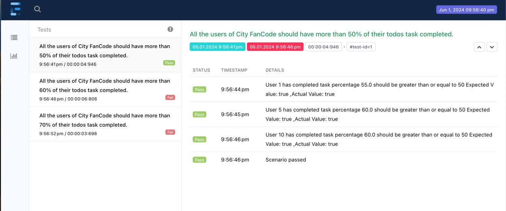

## Prerequisites:
1. Java 22
2. Maven installed

## Running the Code on Your Local Machine:
1. Clone the repository.
2. Open your terminal and navigate to the cloned repository directory.
3. Install the required dependencies by executing this command:
   ```bash
   mvn clean install
    ```
4. Run the application by executing this command:
   ```bash
      mvn test -Dsurefire.suiteXmlFiles=TestNGXml/Fancode.xml
      ```
   
5. Report will be generated in Reports directory.
6. I have added two type of report in the project. One is Extent Report and another one is Cucumber Report. You can check the report in the Reports directory.

Extent Passed Case Report


Extent Failed Case Report


Cucumber Report
